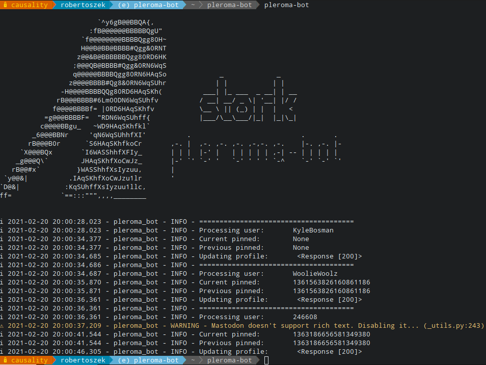

# Stork (pleroma-bot)

[](https://travis-ci.com/robertoszek/pleroma-bot)
[](https://pypi.org/project/pleroma-bot/)
[](https://codecov.io/gh/robertoszek/pleroma-bot)
[](https://www.python.org/downloads/release/python-360/)
[](https://requires.io/github/robertoszek/pleroma-bot/requirements/?branch=master)
[](https://github.com/robertoszek/pleroma-bot/blob/master/LICENSE.md)


Mirror one or multiple Twitter accounts in Pleroma/Mastodon.

## Introduction

After using the pretty cool [mastodon-bot](https://github.com/yogthos/mastodon-bot) for a while, I found it was lacking some actions which were of use to me. 

For precisely those cases I've written this Python project that automates them, asking such info to [Twitter's API](https://developer.twitter.com/en/docs/twitter-api/v1) and updating the relevant fields on the [Pleroma API](https://docs-develop.pleroma.social/backend/API/pleroma_api/)/[Mastodon API](https://docs.joinmastodon.org/client/intro/) side.


## Features 

So basically, it does the following:

* Retrieves **tweets** and posts them on the Fediverse account if their timestamp is newer than the last post.
  * Can filter out RTs or not
  * Can filter out replies or not
* Media retrieval and upload of multiple **attachments**. This includes:
  * Video
  * Images
  * Animated GIFs 
  * Polls
* Retrieves **profile info** from Twitter and updates it in on the Fediverse account. This includes:
  * *Display name*
  * *Profile picture*
  * *Banner image*
  * *Bio text*
* Adds some **metadata fields** to the Fediverse account, pointing to the original Twitter account or custom text.

## Installation
```
$ pip install pleroma-bot
```
## Usage
```console
$ pleroma-bot [--noProfile] [--forceDate [FORCEDATE]]
```

```console
Bot for mirroring one or multiple Twitter accounts in Pleroma/Mastodon.

optional arguments:
  -h, --help            show this help message and exit
  -n, --noProfile       skips Fediverse profile update (no background image,
                        profile image, bio text, etc.)
  --forceDate [FORCEDATE]
                        forces the tweet retrieval to start from a specific
                        date. The twitter_username value (FORCEDATE) can be
                        supplied to only force it for that particular user in
                        the config
  -s, --skipChecks      skips first run checks
  --verbose, -v
  --version             show program's version number and exit
```
### Before running
You'll need the following:

* A [Twitter Bearer Token](https://developer.twitter.com/en/docs/authentication/api-reference/token)
* The user/users [Pleroma/Mastodon Bearer Tokens](https://tinysubversions.com/notes/mastodon-bot/)

If you plan on retrieving tweets from an account which has their tweets **protected**, you'll also need the following:
* Consumer Key and Secret. You'll find them on your project app keys and tokens section at [Twitter's Developer Portal](https://developer.twitter.com/en/portal/dashboard)
* Access Token Key and Secret.  You'll also find them on your project app keys and tokens section at [Twitter's Developer Portal](https://developer.twitter.com/en/portal/dashboard). 
Alternatively, you can obtain the Access Token and Secret by running [this](https://github.com/joestump/python-oauth2/wiki/Twitter-Three-legged-OAuth-Python-3.0) locally, while being logged in with a Twitter account which follows or is the owner of the protected account

Create a ```config.yml``` file in the same path where you are calling ```pleroma-bot```. There's a config example in this repo called ```config.yml.sample``` that can help you when filling yours out:
```yaml
twitter_base_url: https://api.twitter.com/1.1
# Change this to your Fediverse instance
pleroma_base_url: https://pleroma.robertoszek.xyz
# (optional) Change this to your preferred nitter instance
nitter_base_url: https://nitter.net
# How many tweets to get in every execution
# Twitter's API hard limit is 3,200
max_tweets: 40
# Twitter bearer token
twitter_token: XXXXXXXXXXXXXXXXXXXXXXXXXXXXXXXXXXXXXXXXXXXXXXXXXXXXXXXXXXXXXXXXXXXXXXX
# List of users and their attributes
users:
- twitter_username: KyleBosman
  pleroma_username: KyleBosman
  # Mastodon/Pleroma token obtained by following the README.md
  pleroma_token: XXXXXXXXXXXXXXXXXXXXXXXXXXXXXXXXXXXXXX
  # (optional) keys and secrets for using OAuth 1.0a (for protected accounts)
  consumer_key: xxxxxxxxxxxxxxxxxxxxxxxxx
  consumer_secret: xxxxxxxxxxxxxxxxxxxxxxxxxxxxxxxxxxxxxxxxxxxxxxxxxxxxxxxxxxx
  access_token_key: xxxxxxxxxxxxxxxxxxxxxxxxxxxxxxxxxxxxxxxxxxxxxxxxxxxxxxxxxx
  access_token_secret: xxxxxxxxxxxxxxxxxxxxxxxxxxxxxxxxxxxxxxxxxxxxxxxxxxxx
  # If you want to add a link to the original status or not
  signature: true
  # (optional) If you want to download Twitter attachments and add them to the Pleroma posts.
  # By default they are not
  media_upload: true
  # (optional) If twitter links should be changed to nitter ones. By default they are not
  nitter: true
  # (optional) If mentions should be transformed to links to the mentioned Twitter profile
  rich_text: true
  # (optional) visibility of the post. Must one of the following: public, unlisted, private, direct
  # by default is "unlisted"
  visibility: "unlisted"
  # (optional) Force all posts for this account to be sensitive or not
  # The NSFW banner for the instance will be shown for attachments as a warning if true
  # If not defined, the original tweet sensitivity will be used on a tweet by tweet basis
  sensitive: false
  # (optional) If RTs are to be also be posted in the Fediverse account. By default they are included
  include_rts: false
  # (optional) If replies are to be also posted in the Fediverse account. By default they are included
  include_replies: false
  # (optional) How big attachments can be before being ignored and not being uploaded to the Fediverse post
  # Examples: "30MB", "1.5GB", "0.5TB"
  file_max_size: 500MB
  # additional custom-named attributes
  support_account: robertoszek
  # you can use any attribute from 'user' inside a string with {{ attr_name }} and it will be replaced
  # with the attribute value. e.g. {{ support_account }}
  bio_text: "\U0001F916 BEEP BOOP \U0001F916 \nI'm a bot that mirrors {{ twitter_username }} Twitter's\
    \ account. \nAny issues please contact @{{ support_account }} \n \n " # username will be replaced by its value
  # Optional metadata fields and values for the Pleroma profile
  fields:
  - name: "\U0001F426 Birdsite"
    value: "{{ twitter_url }}"
  - name: "Status"
    value: "I am completely operational, and all my circuits are functioning perfectly."
  - name: "Source"
    value: "https://gitea.robertoszek.xyz/robertoszek/pleroma-twitter-info-grabber"
# Mastodon instance example
- twitter_username: WoolieWoolz
  pleroma_username: 24660
  pleroma_base_url: https://botsin.space
  pleroma_token: XXXXXXXXXXXXXXXXXXXXXXXXXXXXXXXXXXXXXX
  # Mastodon doesn't support rich text!
  rich_text: false
  signature: true
  nitter: true
  visibility: "unlisted"
  media_upload: true
  max_tweets: 50
  bio_text: "\U0001F916 BEEP BOOP \U0001F916 \nI'm a bot that mirrors {{ twitter_username }} Twitter's\
    \ account. \nAny issues please contact @{{ support_account }} \n \n " # username will be replaced by its value
  fields:
  - name: "\U0001F426 Birdsite"
    value: "{{ twitter_url }}"
  - name: "Status"
    value: "I am completely operational, and all my circuits are functioning perfectly."
  - name: "Source"
    value: "https://gitea.robertoszek.xyz/robertoszek/pleroma-twitter-info-grabber"
- twitter_username: arstechnica
  pleroma_username: mynewsbot
  pleroma_token: XXXXXXXXXXXXXXXXXXXXXXXXXXXXXXXXXXXXXX
  signature: true
  nitter: true
  visibility: "public"
  media_upload: false
  pleroma_base_url: https://another.pleroma.instance
  max_tweets: 50
  bio_text: "\U0001F916 BEEP BOOP \U0001F916 \n I'm a bot that mirrors {{ twitter_username }} Twitter's\
    \ account. \n Any issues please contact @robertoszek \n \n "
```

Changing the ```users``` to the desired ones. You can add as many users as needed.

Also change the following to your Pleroma/Mastodon instance URL:
```yaml
pleroma_base_url: https://pleroma.robertoszek.xyz
```
### Running

If you're running the bot for the first time it will ask you for the date you wish to start retrieving tweets from (it will gather all from that date up to the present). 
If you leave it empty and just press enter it will default to the oldest date that Twitter's API allows ('```2010-11-06T00:00:00Z```') for tweet retrieval.

To force this behaviour in future runs you can use the ```--forceDate``` argument (be careful, no validation is performed with the already posted toots/posts by that Fediverse account and you can end up with duplicates posts/toots!).

Additionally, you can provide a ```twitter_username``` if you only want to force the date for one user in your config.

For example:

```console
$ pleroma-bot --forceDate WoolieWoolz
```

If the ```--noProfile``` argument is passed, *only* new tweets will be posted. The profile picture, banner, display name and bio will **not** be updated on the Fediverse account.

NOTE: An ```error.log``` file will be created at the path from which ```pleroma-bot``` is being called.

### crontab entry example 
**(everyday at 6:15 AM)** update profile and **(every 10 min.)** post new tweets:
```bash
# Post tweets every 10 min
*/10 * * * * cd /home/robertoszek/myvenv/ && . bin/activate && pleroma-bot noProfile

# Update pleroma profile with Twitter info every day at 6:15 AM
15 6 * * * cd /home/robertoszek/myvenv/ && . bin/activate && pleroma-bot
```

## Screenshots




## Acknowledgements
These projects proved to be immensely useful, they are Python wrappers for the Mastodon API and Twitter API respectively:

* [Mastodon.py](https://github.com/halcy/Mastodon.py)
* [twitter-python](https://github.com/bear/python-twitter)

They were part of the impetus for this project, challenging myself to not just import them and use them, instead opting to directly do the heavy lifting with built-in python modules. 

That and [mastodon-bot](https://github.com/yogthos/mastodon-bot) not working after upgrading the Pleroma instance I was admin on 😅. This event lead to repurposing it and adding the tweet gathering and posting capabilities.

## Contributing

Patches, pull requests, and bug reports are more than [welcome](https://github.com/robertoszek/pleroma-bot/issues/new/choose), please keep the style consistent with the original source.


## License

MIT License

Copyright (c) 2021 Roberto Chamorro / project contributors

Permission is hereby granted, free of charge, to any person obtaining a copy
of this software and associated documentation files (the "Software"), to deal
in the Software without restriction, including without limitation the rights
to use, copy, modify, merge, publish, distribute, sublicense, and/or sell
copies of the Software, and to permit persons to whom the Software is
furnished to do so, subject to the following conditions:

The above copyright notice and this permission notice shall be included in all
copies or substantial portions of the Software.

THE SOFTWARE IS PROVIDED "AS IS", WITHOUT WARRANTY OF ANY KIND, EXPRESS OR
IMPLIED, INCLUDING BUT NOT LIMITED TO THE WARRANTIES OF MERCHANTABILITY,
FITNESS FOR A PARTICULAR PURPOSE AND NONINFRINGEMENT. IN NO EVENT SHALL THE
AUTHORS OR COPYRIGHT HOLDERS BE LIABLE FOR ANY CLAIM, DAMAGES OR OTHER
LIABILITY, WHETHER IN AN ACTION OF CONTRACT, TORT OR OTHERWISE, ARISING FROM,
OUT OF OR IN CONNECTION WITH THE SOFTWARE OR THE USE OR OTHER DEALINGS IN THE
SOFTWARE.

**Tested and confirmed working against** :
* ```Pleroma BE 2.0.50-2547-g5c2b6922-develop```
* ```Mastodon v3.2.1```
* ```Twitter API v1.1 and v2```
